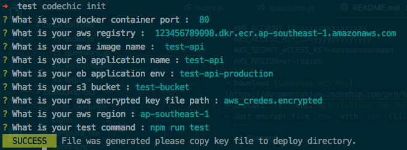

<center>
  <h1>CodeChic CLI</h1>
</center>


# codechic-cli
CLI for setup continuous integration and continuous deployment docker with Codeship Pro to AWS service
## Requirement
  - AWS ACCOUNT ID
  - AWS ACCESS KEY ID
  - AWS SECRET ACCESS KEY
  - AWS Application name
  - AWS application enveronment name
  - S3 bucket name
  - AWS registry
  - Codeship aes key
  - dockerfile
  - npm
## Installation
```
  $git clone https://github.com/Sellsuki/deploy-cli.git
  $cd codechic-cli
  $npm link
```

## Process of Codeship Pro deploy your docker image to EB


# How to use

## 1. Encrypt your AWS credential
  - Step first you must create `env` file (in anywhere) with 
  [Jet CLI](https://documentation.codeship.com/pro/builds-and-configuration/cli/) .

    Example: env
    ```
    AWS_ACCOUNT_ID=xxxxxxxxxxxxxxx
    AWS_ACCESS_KEY_ID=yyyyyyyyyyyyy
    AWS_SECRET_ACCESS_KEY=aaaaaaaaaaaaaa
    AWS_REGION=ur-region
    ```
  - Download [Codeship AES Key](https://documentation.codeship.com/pro/builds-and-configuration/environment-variables/#downloading-your-aes-key)
  - Install `jet` CLI. [(Installing The Jet CLI)](https://documentation.codeship.com/pro/jet-cli/installation/)
  - Just encrypt file `env` with `jet` CLI.
    ```
    // Command:

    $jet encrypt ${YOUR_ENV_FILE} ${OUTPUT_FILE_NAME}

    // Example:

    $jet encrypt env env.encrypted
    ```
## 2. Use `codechic` CLI
  - Run this command :
    ```
    $cd {your-repository}
    $codechic init
    ```
  - Fill your information on console.

    ```
    1. docker port
    2. AWS registry url
    3. Image name on AWS registry
    4. EB application name
    5. EB environment name
    6. S3 bucket
    7. Your encrypted file
    8. AWS region
    ```
    
  
  - You will receive file & directory for deployment.

    

## 3. Create your Dockerfile
  - Move your DockerFile to your repository.
## 4. Copy file encrypted to
```
./deploy/${YOUR_FILE}
```
## 5. Push your code !! 
## ⚠️ ️ BEWARE !!!
  <span style="color:red">
    - Don't push your codeship.aes and your AWS credential file to git.
  </span>
<br><br><br>
Developed with ❤️ and ☕️